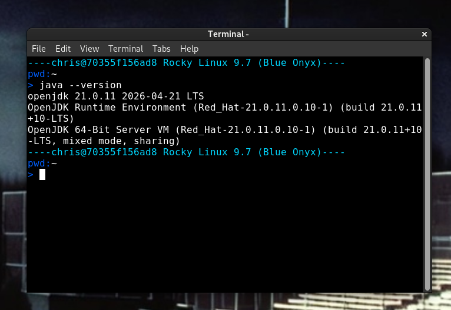
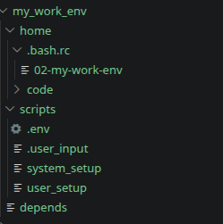

# Spawn
Do you switch physical machines often?<br/><br/>
Quickly regenerate (spawn) your customized environment on any computer supporting containerization.<br/><br/>
Spawn must be run in a linux-like environment with Docker installed. On Windows you can use WSL. A spawned environment can use Docker, LXD, or WSL as a "spawn point". A spawn point is the "infrastructure" on which a spawned environment is executed. Note that Docker is immutable (except for the user's home directory). LXC and WSL are both mutable.

## Create A Spawn
Execute the main spawn script and choose the option to create
```
> spawn
InstanceName         SpawnPoint   Status
=============================================================
my-environment       lxd          STOPPED
=============================================================

What shall we do?
1: run
2: create
3: delete
> 2
```
Then choose a "spawn point" meaning the infrastructure on which you wish to run. If an infrastructure type is not found it will not be an option. We'll build this on top of docker<br/><br/>
"host" means the environment will be established on your current user. This could overwrite some of your local settings. Only do this with a user that you don't care about.
```
Choose a spawn point. This is where we intend to create our instance:
1: host
2: docker
3: lxd
4: wsl
> 2
```
There are some "out of the box" spawn configurations. But the point is to create your own that sets things up the way you like them. Let's choose a simple java developer environment.
```
Choose a spawn configuration?
1: dev_godot
2: dev_java
3: minimalist
4: spawn_host
> 2
```
Name your new environment:
```
Name for the docker container. Warning! If this container name is already in use it will be overwritten
> from-the-readme
```
Spawn will give you the distribution options that are supported for this spawn configuration
```
The available distro options for the dev_java configuration
1: rockylinux:9
2: almalinux:9
3: oraclelinux:9
4: ubuntu:latest
> 1
```
Now watch it build your new java development environment.

## Run Your Spawned Environment
Execute the main spawn script and choose the option to run
```
> spawn
InstanceName         SpawnPoint   Status
=============================================================
from-the-readme      docker       RUNNING
my-environment       lxd          STOPPED
=============================================================

What shall we do?
1: run
2: create
3: delete
> 1
```
Choose the machine we just created
```
Which machine should we run?
1: docker_from-the-readme
2: lxd_my-environment
> 1
```
An xfce4-terminal owned by your new environment is launched. This environment (because you've configured it the way you like it) is already just the way you like to work!

</img>

## Spawn Config
This is where you define your development environment. There are multiple things you can configure. We'll walk through each of them here

</img>

### Dependency

file: /spawn_configs/\<my-config\>/depends<br>
Use an existing spawn config or just add some "_parts". This does some of the work for you before you add any of your customized installation.
```
_parts/vscode
_parts/intellij_idea
_parts/git
_parts/jdk-21
```
## Scripts

### scripts/.env

Optionally you can set up environment variables that will help determine the way your spawn will operate. For example the following will provide the supported images for this machine:<br>
```
docker_distro_options=rockylinux:9,almalinux:9,oraclelinux:9,ubuntu:latest
lxc_distro_options=images:rockylinux/9/amd64,images:almalinux/9/amd64,ubuntu:26.04
```
### scripts/.user_input

Ask for user input here. Example:

```
user_select chosen_widget_versions "Choose from available  versions: " 1.0 1.1 2.0
```
### scripts/system_setup

This is run as root. This is where you install things. All of your yum, apt, dnf, whatever. Anything you are going to need to do as root to the system

### scripts/user_setup

Your non-root user sets up their own directory. Some examples might include cloning a repository, etc.

## home

A lot of files destined for the home directory will be static. No need to make the user_setup script do those. If they're in "home", then they'll be overlayed on the output home directory.<br>
Note: .bashrc is special in spawn. You should not overwrite it. Instead, anything you'd normally do in .bashrc should be in a "child" rc file in ~/.bash.rc/. Everything in there will be executed when .bashrc is sourced.
